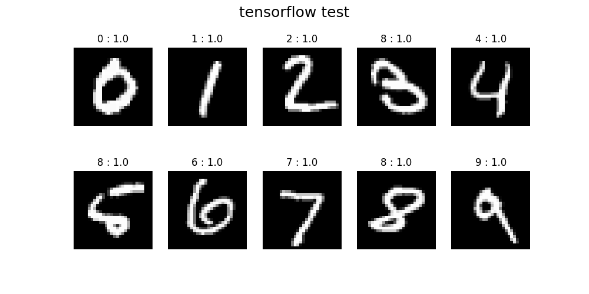
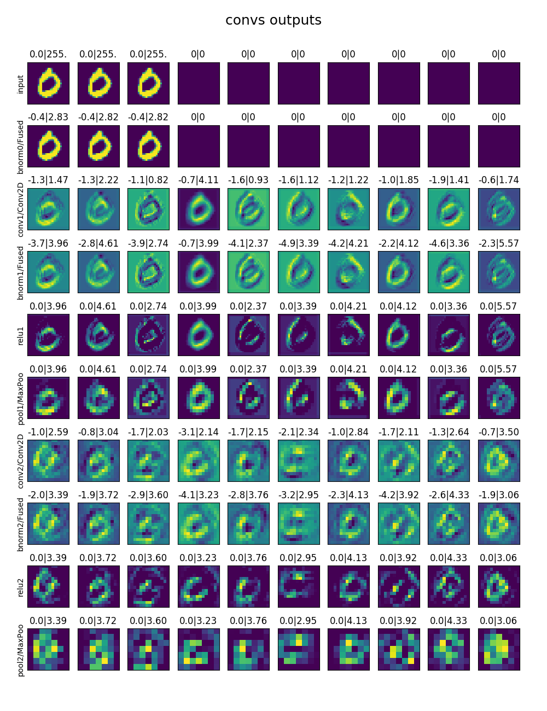
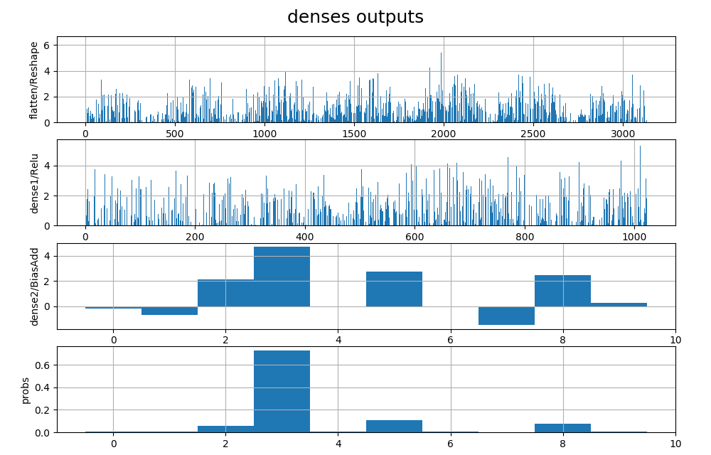

# tf2caffe
Train MNIST-classifier in Tensorflow and convert it to Caffe model.

## Train tensorflow model

Run **train.py** - train tensorflow model. Get checkpoint in temp folder.

```
Loss for final step: 0.028164389
{'accuracy': 0.9684, 'loss': 0.095334284, 'global_step': 1000}
```

Graph structure of tensorflow model (tensorboard-visualization  from log folder)


## Check tf-model on test images

Run **estimator_predict.py** - check tf-model on ten test images. This results will be compared with caffe predictions.



## Visualize layers outputs

Run **tf_predict.py** - visualize outputs of layers after inference model on one example image. This outputs also will be compared with caffe ones.
List of model layers (some axillary layers are hidden):

```
input
conv1/kernel
conv1/bias
conv1/Conv2D
conv1/BiasAdd
conv1/Relu
pool1/MaxPool
conv2/kernel
conv2/bias
conv2/Conv2D
conv2/BiasAdd
conv2/Relu
pool2/MaxPool
flatten/Reshape
dense1/kernel
dense1/bias
dense1/MatMul
dense1/BiasAdd
dense1/Relu
dense2/kernel
dense2/bias
dense2/MatMul
dense2/BiasAdd
probs
```





4. Save weights and biases from tf-model to binary files. Weights has tensorflow format (width, height, channels, filters).

```
conv1-kernel: (5, 5, 3, 32)
conv1-bias: (32,)
conv2-kernel: (5, 5, 32, 64)
conv2-bias: (64,)
dense1-kernel: (3136, 1024)
dense1-bias: (1024,)
dense2-kernel: (1024, 10)
dense2-bias: (10,)
```

5. Build by hands caffe-model with equivalent structure. Model can be easily visualized by Netron program.


