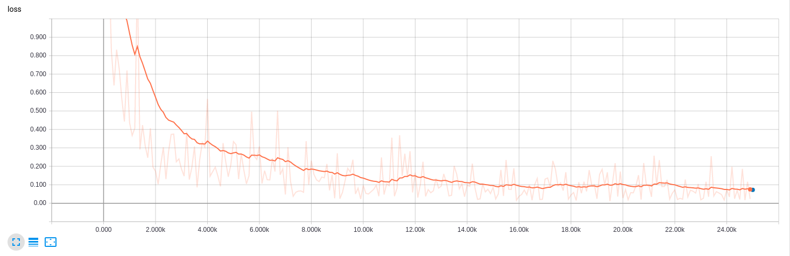
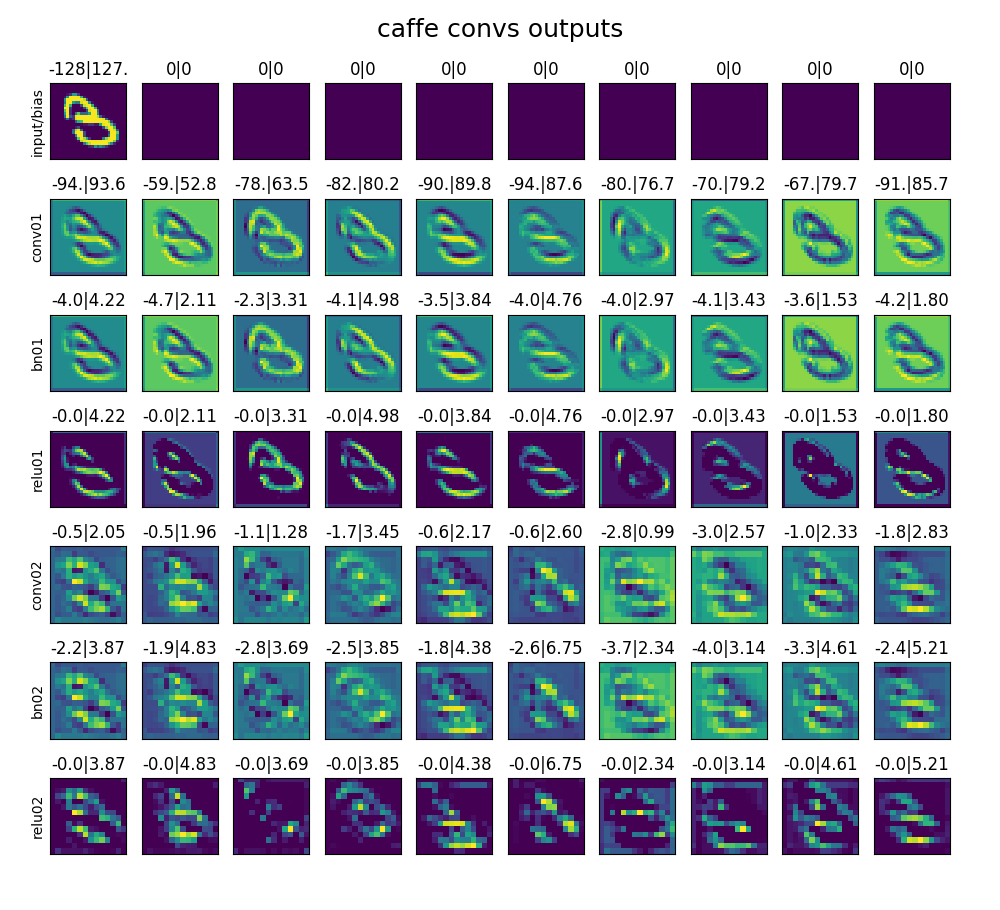

# tf2caffe
Train MNIST-classifier in Tensorflow and convert it to Caffe model.

## Train tensorflow model

Run **train.py** - train tensorflow model. Get checkpoint in temp folder.

```
test accuracy: 0.9828
```

Graph structure of tensorflow model (tensorboard-visualization  from log folder)



## Check tf-model on test images

Run **estimator_predict.py** - check tf-model on ten test images. This results will be compared with caffe predictions.


## Visualize layers outputs

Run **tf_predict.py** - visualize outputs of layers after inference model on one example image. This outputs also will be compared with caffe ones.
List of model layers (some axillary layers are hidden):

```
input
Const
input/Add
conv1/kernel
conv1/kernel/Assign
conv1/kernel/read
conv1/dilation_rate
conv1/Conv2D
bn1/gamma/Initializer/ones
bn1/gamma
bn1/gamma/Assign
bn1/gamma/read
bn1/beta/Initializer/zeros
bn1/beta
bn1/beta/Assign
bn1/beta/read
bn1/moving_mean/Initializer/zeros
bn1/moving_mean
bn1/moving_mean/Assign
bn1/moving_mean/read
bn1/moving_variance/Initializer/ones
bn1/moving_variance
bn1/moving_variance/Assign
bn1/moving_variance/read
bn1/FusedBatchNorm
bn1/Const
relu1
pool1/MaxPool
conv2/kernel
conv2/kernel/Assign
conv2/kernel/read
conv2/dilation_rate
conv2/Conv2D
bn2/gamma/Initializer/ones
bn2/gamma
bn2/gamma/Assign
bn2/gamma/read
bn2/beta/Initializer/zeros
bn2/beta
bn2/beta/Assign
bn2/beta/read
bn2/moving_mean/Initializer/zeros
bn2/moving_mean
bn2/moving_mean/Assign
bn2/moving_mean/read
bn2/moving_variance/Initializer/ones
bn2/moving_variance
bn2/moving_variance/Assign
bn2/moving_variance/read
bn2/FusedBatchNorm
bn2/Const
relu2
pool2/MaxPool
flatten/Shape
flatten/Reshape/shape/1
flatten/Reshape/shape
flatten/Reshape
dense1/kernel
dense1/kernel/Assign
dense1/kernel/read
dense1/bias/Initializer/zeros
dense1/bias
dense1/bias/Assign
dense1/bias/read
dense1/MatMul
dense1/BiasAdd
dense1/Relu
dropout/Identity
dense2/kernel
dense2/kernel/Assign
dense2/kernel/read
dense2/bias/Initializer/zeros
dense2/bias
dense2/bias/Assign
dense2/bias/read
dense2/MatMul
dense2/BiasAdd
classes/dimension
classes
probs

input/Add.....................: mean=-82.80, var=7827.31
conv1/Conv2D..................: mean=2.61,   var=1128.59
bn1/FusedBatchNorm............: mean=-0.02,  var=1.32
relu1.........................: mean=0.38,   var=0.46
conv2/Conv2D..................: mean=0.06,   var=0.65
bn2/FusedBatchNorm............: mean=0.06,   var=1.47
relu2.........................: mean=0.46,   var=0.76
```


4. Save weights and biases from tf-model to binary files. Weights has tensorflow format (width, height, channels, filters).

```
conv1/kernel:0
bn1/gamma:0
bn1/beta:0
bn1/moving_mean:0
bn1/moving_variance:0
conv2/kernel:0
bn2/gamma:0
bn2/beta:0
bn2/moving_mean:0
bn2/moving_variance:0
dense1/kernel:0
dense1/bias:0
dense2/kernel:0
dense2/bias:0
------------------------------------------------------------
Parse and save variables to ./tf_weights/mnistcls
------------------------------------------------------------
conv1/kernel:0                                     -> conv01-kernel                                      (3, 3, 1, 16) -> (16, 1, 3, 3)
bn1/gamma:0                                        -> bn01-gamma                                         (16,) -> (16,)
bn1/beta:0                                         -> bn01-beta                                          (16,) -> (16,)
bn1/moving_mean:0                                  -> moving01-mean                                      (16,) -> (16,)
bn1/moving_variance:0                              -> moving01-var                                       (16,) -> (16,)
conv2/kernel:0                                     -> conv02-kernel                                      (3, 3, 16, 32) -> (32, 16, 3, 3)
bn2/gamma:0                                        -> bn02-gamma                                         (32,) -> (32,)
bn2/beta:0                                         -> bn02-beta                                          (32,) -> (32,)
bn2/moving_mean:0                                  -> moving02-mean                                      (32,) -> (32,)
bn2/moving_variance:0                              -> moving02-var                                       (32,) -> (32,)
dense1/kernel:0                                    -> dense01-kernel                                     (1568, 512) -> (512, 1568)
dense1/bias:0                                      -> dense01-bias                                       (512,) -> (512,)
dense2/kernel:0                                    -> dense02-kernel                                     (512, 10) -> (10, 512)
dense2/bias:0                                      -> dense02-bias                                       (10,) -> (10,)
```

5. Build by hands caffe-model with equivalent structure. Model can be easily visualized by Netron program.





```
conv01
moving01
bn01
conv02
moving02
bn02
dense01
dense02
W1213 17:19:33.398169 25979 gpu_memory.cpp:129] Lazily initializing GPU Memory Manager Scope on device 0. Note: it's recommended to do this explicitly in your main() function.
I1213 17:19:33.398525 25979 gpu_memory.cpp:105] GPUMemory::Manager initialized
I1213 17:19:33.398838 25979 gpu_memory.cpp:107] Total memory: 3157000192, Free: 2197356544, dev_info[0]: total=3157000192 free=2197356544
input/bias....................: mean=-82.80, var=7827.31
conv01........................: mean=2.61, var=1128.59
bn01..........................: mean=-0.02, var=1.32
relu01........................: mean=0.38, var=0.46
conv02........................: mean=0.06, var=0.65
bn02..........................: mean=0.07, var=1.47
relu02........................: mean=0.46, var=0.76
```

